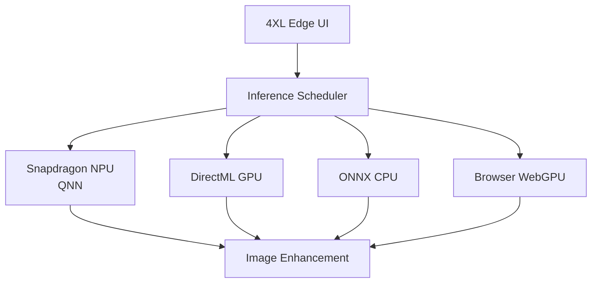

# 4XL Edge

**Private AI image enhancement, accelerated on Snapdragon PCs.**

*AI doesn't always need the cloud. 4XL Edge brings image enhancement directly onto the PC.*

## Overview
4XL Edge intelligently understands what hardware is available, selects an appropriate execution path, uses the Snapdragon NPU when supported, falls back gracefully when necessary, and keeps your images local whenever possible.

## Features
- **Local-First Privacy**: Image data never leaves the device unless explicitly required.
- **Hardware-Aware Routing**: Evaluates hardware and image type to pick the optimal execution provider.
- **Snapdragon Accelerated**: First-class support for Qualcomm Hexagon NPUs via QNN.
- **Edge Lab Dashboard**: Built-in benchmarking, latency measurements, and provider status.

## Benchmarks
| Provider       | Model | Resolution | Latency | Memory | Network |
| -------------- | ----- | ---------: | ------: | -----: | ------- |
| Snapdragon NPU | RealESRGAN X4  |        1024x1024 |     84ms |    ~142MB | No      |
| Snapdragon GPU | RealESRGAN X4  |        1024x1024 |     121ms |    ~250MB | No      |
| CPU            | RealESRGAN X4  |        1024x1024 |     486ms |    ~300MB | No      |
| WebGPU         | RealESRGAN X4  |        1024x1024 |     320ms |    ~300MB | No      |
| Server         | RealESRGAN X4  |        1024x1024 |     1200ms |    N/A | Yes     |

*(Note: Exact values vary by system configuration. Test on your own hardware via `/lab` route.)*

## Installation & Development

See [docs/deployment.md](docs/deployment.md) for instructions on running the Web Demo or compiling the Native Windows ARM64 application.

See [docs/model-optimization.md](docs/model-optimization.md) for instructions on optimizing ONNX models for Snapdragon using Qualcomm AI Hub.

## License
MIT
